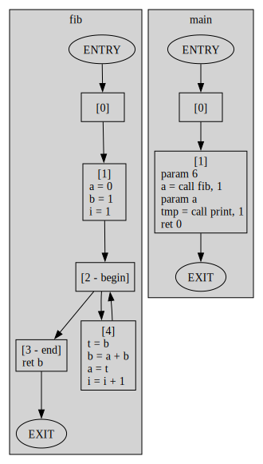

## Intermediate Representation Language
> Planned to be a simpler version of what LLVM is at its core; "An optimizer and transpiler of its very own LLVM IR to various architecture's ISA".

### Grammar
``` asm
function L, n
arg id
id = op
id = op1 arith op2
id = unary op
goto L
label L
if (op1 relop op2) goto L
id = op1 relop op2
param op
id = call L, n
ret op
```

### IRL Architecture


In the IRL architecture, the initial step involves converting the source code into an [AST](https://en.wikipedia.org/wiki/Abstract_syntax_tree) (Abstract Syntax Tree) using the frontend ([`fe`](./src/fe)) module. The resulting AST then passes through a middleware ([`mw`](./src/mw)) module that invokes AST passes for correction and validation. Two default AST passes include [`validate_iden_pass`](./src/mw/validate_iden_pass.rs), which ensures all identifiers used in instructions are valid, and [`add_goto_pass`](./src/mw/add_goto_pass.rs), which inserts `goto` statements before necessary label instructions.

The corrected AST then proceeds to the optimization ([`opt`](./src/opt)) module, where it is transformed into a [CFG](https://en.wikipedia.org/wiki/Control-flow_graph) (Control Flow Graph). This module applies Compiler Passes to the CFG to optimize it, including [`reduce_pass`](./src/opt/reduce_pass.rs) for simplifying the CFG, [`constant_fold_pass`](./src/opt/constant_propagation_pass.rs) for folding constants, and `reaching_definition_pass` for eliminating redundant instructions.

The optimized CFG is then passed to the translation (`trn`) module, which translates it into assembly code tailored to the target architecture.

### Getting Started
``` asm
function fib, 1
    arg n
    a = 0
    b = 1
    i = 1
    label begin
        if (i == n) goto end
        t = b
        b = a + b
        a = t
        i = i + 1
        goto begin
    label end
        ret b

function main, 0
    param 3
    a = call fib, 1
    ret a
```
``` bash
cargo run -- compile -f ./eg/fib.irl --cfg
```
> Generated control flow graph of this example
> 
> 

### CLI Documentation
```md
Compile source code to target(s)

Usage: irl.exe compile [OPTIONS] --filepath <filepath>

Options:
  -f, --filepath <filepath>  Source file path
      --cfg                  Output control flow graph of the program as a svg
  -d, --debug                Dumps debug info onto stdout
  -v, --verbose              Sets info level to verbose
      --wat                  Generates WAT (Web Assembly Text)
      --wasm                 Generates WASM (Web Assembly)
      --fasm                 Generates FASM (Flat Assembly)
  -h, --help                 Print help
```

### Examples
- [Fibonacci](./eg/fib.irl)
- [Constant Propagation Analysis test](./eg/constant_propagation_test.irl)

### Dependencies
- [graphviz - Graph Visualization Tools](https://graphviz.org/download/)
- [flatassembler - tgrysztar](https://flatassembler.net/)
- [wabt - webassembly](https://github.com/WebAssembly/wabt)

### Cortesy
- [fasm-mode - emacsattic](https://github.com/emacsattic/fasm-mode/)
