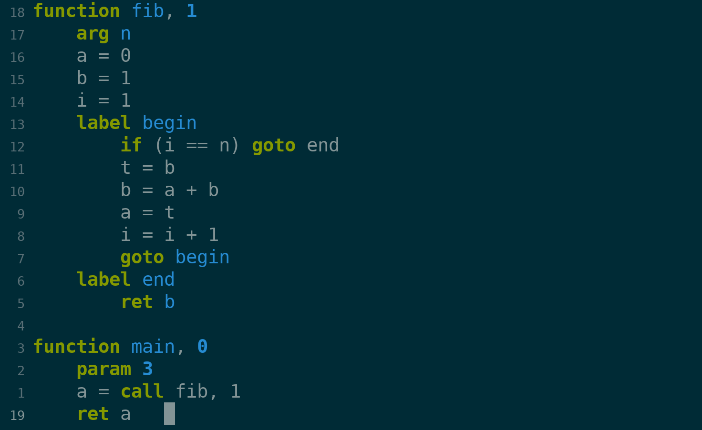

# Editor Plugins

## [Emacs](./irl-mode.el)

### Quick Start
Right now the only way to use this is to
1. `C-x C-f irl-mode.el RET`
2. `M-x eval-buffer RET`
3. `M-x simpc-mode RET`

### References
- [simpc-mode - simple c mode for emacs - rexim](https://github.com/rexim/simpc-mode)
